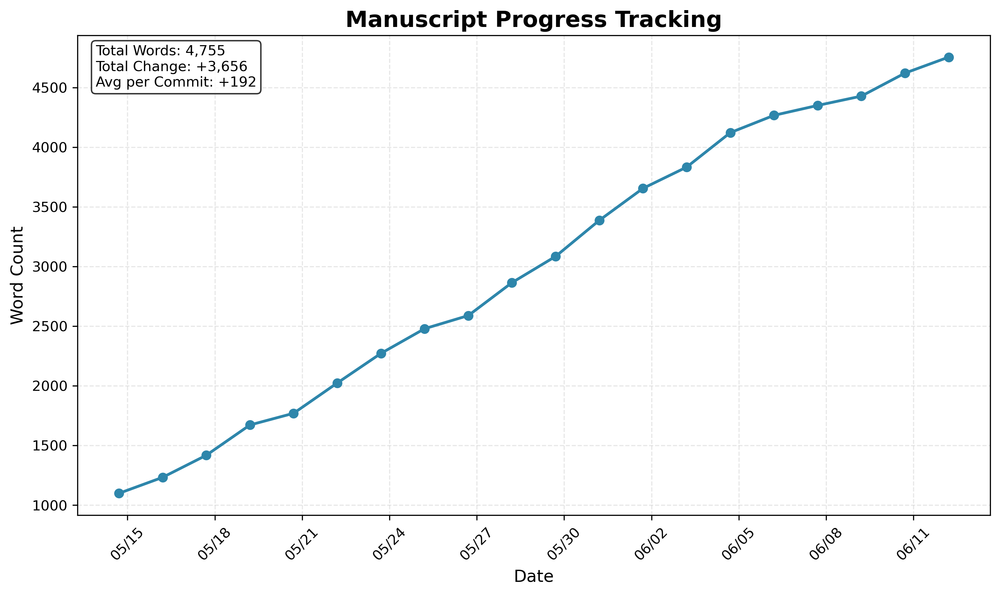

# =� Overleaf Progress Tracker

Automatically track your LaTeX manuscript writing progress with beautiful visualizations and GitHub Actions integration. Perfect for academic papers, theses, and any LaTeX documents managed through Overleaf's GitHub sync.



## ( Features

- **Automatic Word Counting**: Uses `texcount` (Overleaf's official method) for accurate word counts
- **Progress Visualization**: Beautiful matplotlib plots showing your writing progress over time
- **Commit Annotations**: Parse commit messages to add categorized milestones to your plot
- **GitHub Actions Integration**: Runs automatically on every Overleaf sync
- **Easy Setup**: Simple Python script to configure everything
- **Customizable**: Configure plot styles, categories, and tracking options

## =� Quick Start

### Prerequisites

1. An Overleaf project with [GitHub synchronization enabled](https://www.overleaf.com/learn/how-to/Git_Integration_and_GitHub_Synchronization)
2. Python 3.7+ installed locally

**Note**: No GitHub Personal Access Token required! The tracker uses GitHub's built-in token automatically.

### Installation

1. Clone this repository:
```bash
git clone https://github.com/yourusername/overleaf-progress-tracker.git
cd overleaf-progress-tracker
```

2. Install dependencies:
```bash
# Create virtual environment (recommended)
python3 -m venv venv
source venv/bin/activate

# Install packages
pip install -r requirements.txt
```

3. Run the setup script:
```bash
python setup.py
```

The setup script will only prompt you for:
- Path to your manuscript repository

That's it! No tokens or complex authentication needed.

## 📝 Usage

### Commit Message Categories

Use categorized commit messages to add annotations to your progress plot:

- `Notes: Added introduction section` � =�
- `Milestone: Completed literature review` � <�
- `Revisions: Addressed reviewer comments` � 
- `Progress: Wrote methodology section` � =�
- `Fix: Corrected equations in section 3` � ='
- `Reference: Added citations` � =�

### Manual Tracking

You can also trigger the tracking manually:

```bash
# In your manuscript repository
python .github/scripts/track_progress.py
```

## � Configuration

Edit `.progress-tracker.config` in your manuscript repository:

```json
{
  "main_tex_file": "auto",  // or specify like "manuscript.tex"
  "plot_style": {
    "figure_size": [10, 6],
    "line_color": "#2E86AB",
    "categories": {
      "Notes": {"icon": "=�", "color": "#4CAF50"},
      "Milestone": {"icon": "<�", "color": "#FF9800"},
      // Add custom categories here
    }
  },
  "texcount_options": "-inc -chinese -japanese -korean -total"
}
```

## <� How It Works

1. **Overleaf � GitHub**: When you make changes in Overleaf and sync, it pushes to GitHub
2. **GitHub Actions**: The push triggers the tracking workflow
3. **Word Counting**: `texcount` analyzes your LaTeX files
4. **Data Storage**: Progress data is stored in `.progress-data/progress.json`
5. **Visualization**: matplotlib creates an updated progress plot
6. **README Update**: The plot is embedded in your repository's README

## =� Example Output

Your README will automatically include a section like:

```markdown
## =� Manuscript Progress


*Last updated: 2024-01-15 10:30:00 UTC*
```

The plot shows:
- Word count over time
- Total words, total change, and average words per commit
- Categorized commit annotations with dates

## =� Troubleshooting

### Common Issues

1. **"No .tex files found"**
   - Ensure your LaTeX files are in the repository root
   - Check `.progress-tracker.config` to specify the main file

2. **"texcount: command not found"**
   - The GitHub Action installs it automatically
   - For local testing: `sudo apt-get install texlive-extra-utils`

3. **Plot not updating**
   - Check GitHub Actions tab for errors
   - Ensure `GITHUB_TOKEN` secret is set correctly

4. **Word count seems wrong**
   - Adjust `texcount_options` in config
   - Check if all included files are being counted

### Debug Mode

Run locally with verbose output:
```bash
cd your-manuscript-repo
python .github/scripts/track_progress.py --verbose
```

## > Contributing

Contributions are welcome! Please feel free to submit a Pull Request.

1. Fork the repository
2. Create your feature branch (`git checkout -b feature/AmazingFeature`)
3. Commit your changes (`git commit -m 'Add some AmazingFeature'`)
4. Push to the branch (`git push origin feature/AmazingFeature`)
5. Open a Pull Request

## =� License

This project is licensed under the MIT License - see the [LICENSE](LICENSE) file for details.

## =O Acknowledgments

- Inspired by [latex-progress-tracker](https://github.com/tjburch/latex-progress-tracker)
- Uses [texcount](https://app.uio.no/ifi/texcount/) for accurate word counting
- Built with [matplotlib](https://matplotlib.org/) for visualizations

## =� Support

- Create an [issue](https://github.com/yourusername/overleaf-progress-tracker/issues) for bugs
- Start a [discussion](https://github.com/yourusername/overleaf-progress-tracker/discussions) for features
- Check the [wiki](https://github.com/yourusername/overleaf-progress-tracker/wiki) for advanced usage

---

Made with d for academic writers everywhere